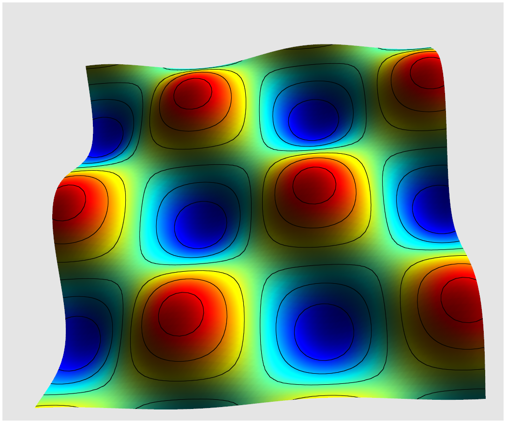

# BSP OpenGL Scientific Visualization

A real-time scientific visualization application built with modern OpenGL 4.3+. This project demonstrates advanced rendering techniques for visualizing scalar fields, including colormaps, isolines, mesh displacement, and GPU-accelerated normal computation using compute shaders.



---

## Some key points about the project:
  - Switch between procedural plane and a 3D model (airplane) with `M` key
    -- Used a simple procedural plane for testing and development, specifically to visualize contour lines and displacement effects clearly.
  - Compute Shaders for recomputation of normals after displacement as well as smoothing those normals.
  - Avoided the "noise" in the scalar field to create smooth contours (isolines).
  - The application is designed to run on Windows 10/11 with a GPU that supports OpenGL 4.3 or higher. It is built using Visual Studio and includes all necessary dependencies
  - Windows SDK : Windows 10.0 SDK (latest) + Platform Toolset : v145
  - Implemented Problem A ( Core + Level2 + Level3 )
  - Wireframe rendering along with the solid mesh in a single pass using barycentric coordinates was very interesting to see.

--- 

## Table of Contents

1. [Features](#features)
2. [Requirements](#requirements)
3. [Building the Project](#building-the-project)
4. [Running the Application](#running-the-application)
5. [Controls Reference](#controls-reference)
6. [Feature Documentation](#feature-documentation)
7. [Technical Architecture](#technical-architecture)
8. [Shader Files](#shader-files)
9. [Troubleshooting](#troubleshooting)

---

## Features

### Core Visualization Features
- **Scientific Colormaps**: Viridis, Turbo, and Jet color schemes
- **Scalar Field Visualization**: Real-time mapping of scalar values to colors
- **Interactive Scalar Range**: Adjustable min/max thresholds with clipping
- **Wireframe Overlay**: Adjustable thickness wireframe rendering
- **Isoline Rendering**: Contour lines at user-specified intervals
- **Mesh Displacement**: Real-time vertex displacement based on scalar field

### GPU Compute Features (OpenGL 4.3+)
- **Normal Recomputation**: GPU-accelerated face normal calculation after displacement
- **Normal Smoothing**: Averaging normals across shared vertices for smooth shading

### Additional Features
- **Model Switching**: Toggle between visualization plane and 3D model
- **Orbit Camera**: Mouse-controlled camera with zoom
- **Real-time Parameter Adjustment**: All parameters adjustable via keyboard

---

## Requirements

### Software Requirements
- **Visual Studio 2019/2022** (Community Edition or higher)
- **Windows 10/11** (64-bit)
- **GPU with OpenGL 4.3+ support** (for compute shaders)

### Dependencies (included in project)
- **GLFW 3.x** - Window and input management
- **GLAD** - OpenGL function loader
- **GLM** - Mathematics library
- **Assimp** - 3D model loading
- **stb_image** - Texture loading

---

## Building the Project

### Step 1: Clone the Repository
```bash
git clone https://github.com/rakeshcjadav/BSP_OpenGL_ADB.git
cd BSP_OpenGL_ADB
```

### Step 2: Open in Visual Studio
1. Open `BSP_OpenGL_ADB.sln` in Visual Studio
2. Select **Debug** or **Release** configuration
3. Select **x86** platform (no support for x64)

### Step 3: Build the Solution
- Press `Ctrl+Shift+B` or go to **Build → Build Solution**
- The executable will be created in `Debug/` or `Release/` folder

### Step 4: Verify Shader Files
Ensure the `media/shaders/` folder is in the working directory:
```
BSP_OpenGL_ADB/
├── Debug/
│   └── BSP_OpenGL_ADB.exe
├── media/
│   ├── shaders/
│   │   ├── lit.vert
│   │   ├── lit.frag
│   │   ├── common.glsl
│   │   ├── recompute_normals.comp
│   │   ├── smooth_normals.comp
│   │   ├── copy_normals.comp
│   │   ├── smooth_scalars.comp
│   │   └── copy_scalars.comp
│   └── models/
│       └── airplane/
```

---

## Running the Application

### From Visual Studio
1. Press `F5` to run with debugger, or `Ctrl+F5` to run without

### From Command Line
```bash
cd Debug
BSP_OpenGL_ADB.exe
```

### Expected Output
- A window opens showing a colored mesh with the Viridis colormap
- Console window displays status messages and current parameter values

---

## Controls Reference

### Quick Reference Card

| Key | Action | Range/Notes |
|-----|--------|-------------|
| **Colormaps** |||
| `1` | Viridis colormap | Purple → Green → Yellow |
| `2` | Turbo colormap | Blue → Cyan → Yellow → Red |
| `3` | Jet colormap | Blue → Cyan → Green → Yellow → Red |
| **Scalar Range** |||
| `Q` | Decrease min threshold | 0.0 - 1.0, step: -0.05 |
| `W` | Increase min threshold | 0.0 - 1.0, step: +0.05 |
| `E` | Decrease max threshold | 0.0 - 1.0, step: -0.05 |
| `R` | Increase max threshold | 0.0 - 1.0, step: +0.05 |
| **Wireframe** |||
| `T` | Toggle wireframe | ON/OFF |
| `Y` | Decrease thickness | 0.1 - 5.0, step: -0.3 |
| `U` | Increase thickness | 0.1 - 5.0, step: +0.3 |
| **Displacement** |||
| `I` | Decrease displacement | 0.0 - 10.0, step: -0.5 |
| `O` | Increase displacement | 0.0 - 10.0, step: +0.5 |
| **Isolines** |||
| `P` | Toggle isolines | ON/OFF |
| `[` | Decrease interval | 0.05 - 2.0, step: -0.05 |
| `]` | Increase interval | 0.05 - 2.0, step: +0.05 |
| `;` | Decrease thickness | 0.5 - 5.0, step: -0.3 |
| `'` | Increase thickness | 0.5 - 5.0, step: +0.3 |
| **Compute Shaders** |||
| `C` | Toggle normal recomputation | Requires displacement > 0 |
| `N` | Toggle normal smoothing | Smooth/Flat shading |
| `S` | Apply scalar smoothing | One-time application |
| `G` | Decrease smoothing factor | 0.0 - 1.0, step: -0.1 |
| `H` | Increase smoothing factor | 0.0 - 1.0, step: +0.1 |
| **Model** |||
| `M` | Switch model | Plane ↔ Airplane |
| **Camera** |||
| `Mouse Drag` | Orbit camera | Left button + drag |
| `Scroll` | Zoom in/out | Mouse wheel |

---

## Feature Documentation

### 1. Scientific Colormaps

The application provides three perceptually-uniform colormaps commonly used in scientific visualization:

#### Viridis (Key: 1)
- **Best for**: General-purpose visualization
- **Properties**: Perceptually uniform, colorblind-friendly
- **Range**: Dark purple → Blue → Green → Yellow

#### Turbo (Key: 2)
- **Best for**: High dynamic range data
- **Properties**: Improved rainbow colormap
- **Range**: Dark blue → Cyan → Green → Yellow → Red

#### Jet (Key: 3)
- **Best for**: Legacy compatibility
- **Properties**: Classic rainbow colormap
- **Range**: Blue → Cyan → Green → Yellow → Red

**Implementation**: Defined in `media/shaders/common.glsl`

---

### 2. Scalar Range Adjustment

Control the visible range of scalar values with min/max thresholds.

**How it works**:
- Values below minimum are **discarded** (not rendered)
- Values above maximum are **discarded** (not rendered)
- Values within range are **normalized** to [0,1] for colormap

**Use cases**:
- Focus on specific value ranges
- Filter out noise or outliers
- Create stepped visualizations

**Controls**:
- `Q`/`W`: Adjust minimum threshold
- `E`/`R`: Adjust maximum threshold

---

### 3. Wireframe Rendering

Overlay triangle edges on the colored surface.

**How it works**:
- Uses **barycentric coordinates** stored per-vertex
- Computed in fragment shader using `fwidth()` for screen-space anti-aliasing
- No geometry shader required

**Controls**:
- `T`: Toggle wireframe on/off
- `Y`/`U`: Adjust line thickness

**Implementation**: Fragment shader `edgeFactor()` function in `lit.frag`

---

### 4. Mesh Displacement

Deform the mesh surface based on per-vertex displacement vectors.

**How it works**:
- Each vertex stores a displacement vector: `vec3(cos(x*5)*0.1, sin(y*5)*0.1, scalar*0.05)`
- Displacement is applied in the vertex shader
- Scale factor controls the intensity

**Controls**:
- `I`: Decrease displacement scale
- `O`: Increase displacement scale

**Note**: For correct lighting after displacement, enable normal recomputation (`C` key)

---

### 5. Isoline (Contour Line) Rendering

Display contour lines at regular scalar value intervals.

**How it works**:
- Computed **entirely in fragment shader** (single pass)
- Uses `mod()` to find distance to nearest isoline
- Anti-aliased using `fwidth()` for smooth lines

**Controls**:
- `P`: Toggle isolines on/off
- `[`/`]`: Adjust interval between lines
- `;`/`'`: Adjust line thickness

**Mathematical basis**:
```glsl
float normalizedValue = (scalarValue - minVal) / (maxVal - minVal);
float modValue = mod(normalizedValue, isolineInterval);
float minDist = min(modValue, isolineInterval - modValue);
```

---

### 6. GPU Normal Recomputation (Compute Shader)

Recalculate surface normals after mesh displacement using GPU compute shaders.

**Why it's needed**:
- Original normals point in the pre-displacement direction
- After displacement, lighting looks incorrect
- This computes accurate face normals for the deformed surface

**How it works**:
1. Reads vertex positions + displacement from VBO (as SSBO)
2. Computes displaced positions
3. Calculates face normal via cross product
4. Writes normal back to VBO

**Controls**:
- `C`: Toggle automatic normal recomputation
- Only active when displacement > 0

**Shader**: `media/shaders/recompute_normals.comp`

---

### 7. Normal Smoothing (Compute Shader)

Average normals across vertices at shared positions for smooth shading.

**Why it's needed**:
- Face normals create faceted/flat appearance
- Smooth normals create gradual lighting transitions
- Essential for organic/curved surfaces

**How it works**:
1. For each vertex, find neighboring triangles
2. Average the face normals of neighbors
3. Copy smoothed normals back to VBO

**Controls**:
- `N`: Toggle normal smoothing on/off

**Shaders**: 
- `media/shaders/smooth_normals.comp` - Computes averages
- `media/shaders/copy_normals.comp` - Copies results to VBO

---

### 8. Scalar Smoothing (Compute Shader)

Reduce noise in the scalar field using GPU-accelerated averaging.

**Why it's needed**:
- Raw data may contain noise
- Smoothing creates cleaner visualizations
- Results in smoother isolines

**How it works**:
1. For each vertex, find vertices at same position
2. Average their scalar values with weighted blend
3. Copy smoothed values back to VBO

**Controls**:
- `S`: Apply one smoothing pass
- `G`/`H`: Adjust smoothing factor (0.0 = none, 1.0 = full)

**Shaders**:
- `media/shaders/smooth_scalars.comp` - Computes averages
- `media/shaders/copy_scalars.comp` - Copies results to VBO

---

## Technical Architecture

### Class Structure

```
CMain (Entry Point)
├── CViewport (Window/Context Management)
│   └── GLFW, GLAD initialization
├── CScene (Scene Management)
│   ├── CCamera (View/Projection)
│   ├── CModel (Mesh + Material)
│   │   ├── CMesh (Vertex Data, VAO/VBO)
│   │   └── CMaterial (Shader Programs)
│   ├── CLight (Directional Light)
│   └── CProgram (Compute Shaders)
└── Input Handling (Keyboard/Mouse)
```

### Mesh Data Structure

```cpp
struct SVertex {
    glm::vec3 position;      // Offset: 0  (3 floats)
    glm::vec3 normal;        // Offset: 3  (3 floats)
    glm::vec2 uv;            // Offset: 6  (2 floats)
    glm::vec2 colorRange;    // Offset: 8  (2 floats) - scalar value in .x
    glm::vec3 barycentric;   // Offset: 10 (3 floats)
    glm::vec3 displacement;  // Offset: 13 (3 floats)
};                           // Total: 16 floats per vertex
```

### Rendering Pipeline

```
1. Scene::Render()
   ├── [Optional] RunComputeNormalsShader()  // If displacement enabled
   ├── [Optional] RunSmoothNormalsShader()   // If smooth normals enabled
   │
   ├── Bind Material (Shader Program)
   ├── Set Uniforms (Camera, Light, Parameters)
   │
   └── For each mesh:
       └── glDrawArrays(GL_TRIANGLES, ...)

2. Vertex Shader (lit.vert)
   ├── Apply displacement
   ├── Transform to clip space
   └── Pass data to fragment shader

3. Fragment Shader (lit.frag)
   ├── Apply colormap based on scalar value
   ├── Calculate lighting
   ├── [Optional] Apply wireframe
   ├── [Optional] Apply isolines
   └── Output final color
```

---

## Shader Files

| File | Type | Purpose |
|------|------|---------|
| `lit.vert` | Vertex | Main vertex shader with displacement |
| `lit.frag` | Fragment | Colormap, lighting, wireframe, isolines |
| `common.glsl` | Include | Colormap functions, light structs |
| `recompute_normals.comp` | Compute | Face normal calculation |
| `smooth_normals.comp` | Compute | Normal averaging |
| `copy_normals.comp` | Compute | Copy normals to VBO |
| `smooth_scalars.comp` | Compute | Scalar value averaging |
| `copy_scalars.comp` | Compute | Copy scalars to VBO |

---

## Troubleshooting

### Black Screen
- Check if shaders compiled successfully (console output)
- Verify `media/shaders/` folder is accessible
- Check OpenGL version (requires 4.3+)

### Black Strips on Mesh
- This indicates invalid normals from compute shader
- Press `C` to disable compute normals temporarily
- Check GPU supports compute shaders

### Slow Performance
- Reduce displacement scale
- Disable normal smoothing
- Use Release build instead of Debug

### Shader Compilation Errors
- Check console for specific error messages
- Verify all shader files are present
- Check for OpenGL driver updates

### Model Not Loading
- Verify model path in `Scene.cpp`
- Check Assimp library is linked correctly
- Ensure model file exists in `media/models/`

---

## License

This project is provided for educational purposes.

---

## Acknowledgments

- **GLFW** - Window management
- **GLAD** - OpenGL loader
- **GLM** - Mathematics
- **Assimp** - Model loading
- Colormap implementations based on Matplotlib colormaps

---

## Contact

Repository: https://github.com/rakeshcjadav/BSP_OpenGL_ADB

Branch: `visualization`
